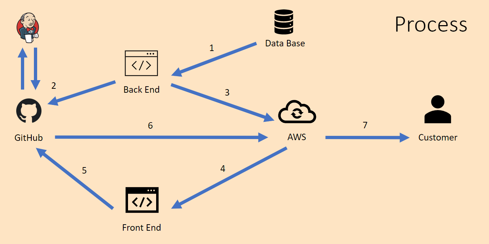
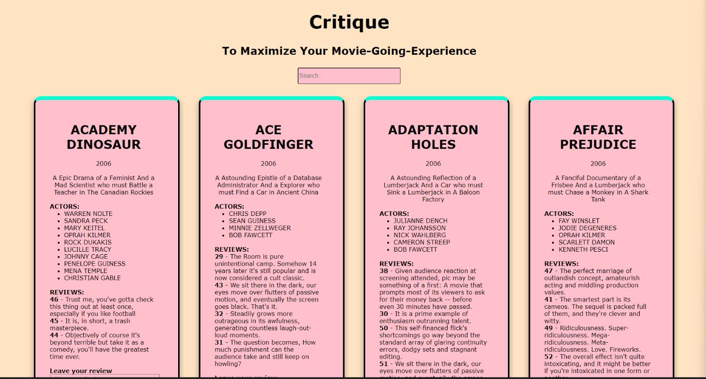
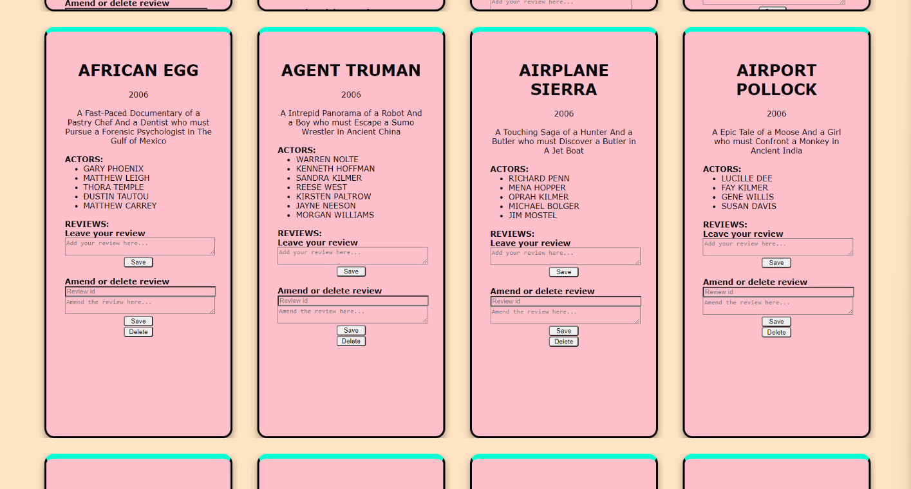

# critique - Front-End - Film reviews webiste

Author: Orestas Dulinskas

## Packages Used (Runtime Requirements)

### Core Utilities

- Microsoft Visual Studio Code
- Amazon Web Services (AWS)

### Extra Utilities

- React library
- Node.js

## Development Process

Front-End of the website:

1. Front-End application
   1. Built using React library
   2. Back-End API called to bring database and REST API functionality

## Website

